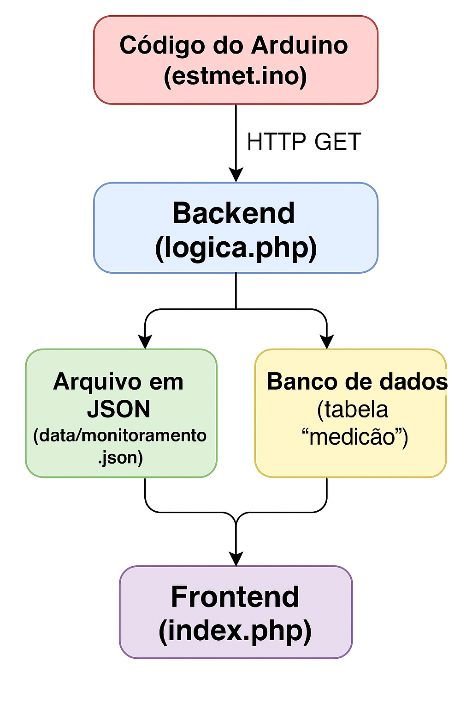

# Estação Meteorológica IFPR - Ivaiporã

Dashboard para visualização de dados meteorológicos em tempo real + sistema de hardware para envio das informações utilizando ESP32/Arduino Nano ESP32 via protocolo HTTP.

## Requisitos

**Hardware:**

1. ESP32 ou Arduino Nano ESP32 (ou equivalentes)
2. DHT22 com abrigo externo
3. Pluviômetro digital
4. Anemômetro digital
5. Biruta eletrônica
6. Sensor de Pressão Barométrico BMP180
7. Sensor de Luz UV GUVA-S12S
8. LDR

**Software:**

1. PHP 7.4 ou superior
2. MySQL 5.7 ou superior
3. Servidor web (Apache/Nginx)
4. Navegador web moderno

## Instalação parte hardware

1. Copie ou baixe o código `arduino/estmet.ino` com suas bibliotecas equivalentes
2. Siga as instruções de montagem dos sensores conforme o código

## Instalação parte servidor

1. Clone este repositório para seu servidor web:

```bash
git clone https://github.com/gabclima/estmet.git
```

2. Importe o banco de dados:

- Acesse o phpMyAdmin
- Crie um novo banco de dados chamado `estmet`
- Importe o arquivo `database.sql`

3. Configure as credenciais do banco de dados:

- Abra o arquivo `config/database.php`
- Atualize as credenciais conforme seu ambiente:

```php
private $host = "localhost";
private $db_name = "estmet";
private $username = "seu_usuario";
private $password = "sua_senha";
```

4. Configure as permissões dos diretórios:

```bash
chmod 755 -R /caminho/para/o/projeto
```

## Estrutura do Projeto



```
estmet/
├── arduino/
│   └── estmet.ino
├── api/
│   └── get_data.php
├── config/
│   └── database.php
├── css/
│   └── style.css
├── js/
│   └── main.js
├── data/
│   └── monitoramento.json
├── style/
│   └── dashboard.css / form_cad.css
├── database.sql
├── index.php
├── logica.php
└── README.md
```

## Funcionalidades

- Visualização em tempo real dos dados dos sensores:

  - Temperatura e Umidade (DHT22)
  - Irradiância UV (GUVA-S12S)
  - Luminosidade (LDR)
  - Velocidade do Vento (Anemômetro)
  - Direção do Vento (Biruta Digital)
  - Precipitação (Pluviômetro)
  - Pressão atmosférica (BMP180)

- Armazenamento:

  - Arquivo local `data/monitoramento.json`
  - Banco de dados MySQL (tabela `medicao`)

- Dashboard:

  - Cards interativos e atualizados automaticamente
  - Gráficos históricos (24h, semana, mês)
  - Tema claro e escuro
  - Exportação de dados para XLS

## Atualização dos Dados

Os dados são atualizados automaticamente a cada minuto. Para modificar este intervalo, altere o valor em `js/main.js`:

```javascript
setInterval(updateData, 60000); // 60000ms = 1 minuto
```

## Contribuição

1. Faça um fork do projeto
2. Crie uma branch para sua feature (`git checkout -b feature/nova-feature`)
3. Commit suas mudanças (`git commit -m 'Adiciona nova feature'`)
4. Push para a branch (`git push origin feature/nova-feature`)
5. Abra um Pull Request

## Licença

Este projeto está licenciado sob a licença MIT - veja o arquivo LICENSE para detalhes.

